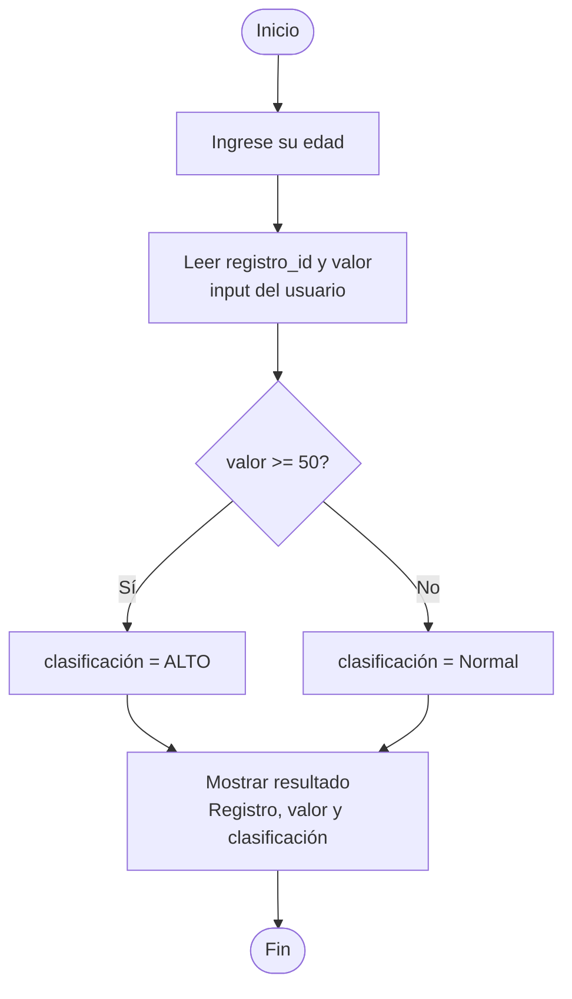

# Bitacora Semana 1

## Registro

Se le pide al usuario un identificador de registro (texto) y un valor numérico, luego aplicamos una regla sencilla para clasificar ese valor: si es mayor o igual a 50 lo marca como "ALTO", y si es menor lo marca como "NORMAL"; finalmente imprime en pantalla un resumen con el identificador, el valor ingresado y la clasificación obtenida, todo organizado dentro de una función main() que se ejecuta solo si el archivo corre directamente (gracias al bloque if __name__ == "__main__":).

